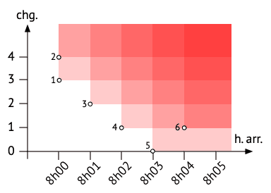

# 🚞 ReCHor: 瑞士公共交通路线规划引擎

  <b>简体中文</b> | <a href="README.md">English</a>

> **演示说明：** 本仓库仅用于项目展示集。如需了解代码实现细节，请通过邮件联系：**<steven.ji@epfl.com>**。

*一个完全离线、高度优化的瑞士公共交通网络路线规划引擎。*

## 📖 概览

**ReCHor** (Recherche d'Horaire) 是一款面向海量数据的离线路线搜索引擎。它直接利用本地时刻表二进制数据，在瑞士全境公共交通网络中高效计算最优出行方案。

该系统提供的结果可与 [CFF/SBB](https://www.cff.ch/) 或 [search.ch](https://search.ch) 等官方平台相媲美，能够很好地在**旅行时间**和**换乘次数**之间寻找最佳平衡点。它还配备了在动态地图 (`uMap`/`GeoJSON`) 上可视化路线以及导出到个人日历（`iCalendar` 格式）的实用功能。

  
   
  <em>ReCHor 用户图形界面，展示了搜索出的帕累托最优路线。</em>

### 📊 项目统计

- **核心代码量**：约 **5,000 行 Java 源代码**（仅计 `ch.epfl.rechor` 核心包）。
- **数据规模**：支持在 **30,000 多个站点**和约 **3,000,000 条日均交通连接**（源自瑞士全境时刻表数据集）中进行高效检索。
- **性能表现**：在普通消费级硬件上，仅需约 **2-3 秒**即可完成整个瑞士交通网络的帕累托前沿完整计算。

### 🏗️ 架构设计与 OOP 实践

该项目实现了一套复杂的面向对象架构，旨在高效管理高密度的交通数据：

- **面向接口编程**：核心实体（车站、路线、车次）均定义为严格的接口，支持在标准实现与高效的缓冲区（Buffered）实现之间无缝切换。
- **享元模式与缓冲区优化 (Flyweight/Buffered)**：为了在扫描数百万条连接时保持极低的内存占用，系统采用了自定义的 `StructuredBuffer` 架构。数据仅在需要时直接从内存映射缓冲区中读取，有效避免了创建数百万个对象带来的内存开销和 GC 压力。
- **现代 Java 特性**：深入应用 **Records**、**Sealed Interfaces** 和 **Streams**，在利用新特性的同时保障了系统的高度可靠与类型严谨。

---

## 🧠 核心技术原理解析

### 1. 多目标优化：帕累托前沿 (Pareto Front)

在计算路线时，乘客很少只在乎单一的指标；他们通常会同时权衡多个标准：

- **时间**（尽可能早到，或者尽可能晚走）
- **便利性**（尽量减少换乘次数）

ReCHor 并没有将这些维度主观地加权混合成一个生硬的“评分”，而是采用了**帕累托前沿 (Pareto Front)** 这一经典的多目标优化概念。

#### 什么是帕累托前沿？

  

在多目标优化问题中，如果一个解决方案在不降低其他标准的情况下，无法在某一个标准上得到进一步改善，那么该解决方案就被认为是“帕累托最优”的。
例如，一条在 17:57 到达且需要 4 次换乘的潜在路线如果是帕累托最优的，意味着要想在 17:57 之前到达并且*换乘次数更少*，唯一的办法就是大大提前出发时间。

ReCHor 维护着这些最优方案组成的“前沿”。当搜索路线时，它不会只返回一个单一、固定的方案，而是返回一个包含所有最优旅程的集合。用户可以自行决定：*“我是应该提前 20 分钟出发以减少换乘，还是选择那条速度更快但换乘更频繁的路线？”*

### 2. 核心引擎：连接扫描算法 (CSA)

大多数经典引擎（如地图导航）依赖于基于图的算法（如 Dijkstra 或 A*）。ReCHor 则采用了一种针对大规模连接优化的专业技术：**连接扫描算法 (Connection Scan Algorithm, CSA)**。

#### CSA 是如何工作的？

传统的算法通常需要构建一个包含大量节点（车站）和边（路线）的庞大图网络并在其中进行深挖搜索。CSA 的方法则截然不同，它更加简洁且执行效率极高：它将每日时刻表视为一个庞大的**连接 (Connections)** 数组（即两个紧邻站点间的直达行程），并按出发时间进行降序排列。

该算法在一次单一的扫描中遍历给定日期的每一个独立连接。在分析每个连接时，引擎会为虚拟乘客递归评估**三个基本选项**：

1. **步行至终点：** 乘客可以在该到达站下车并步行至最终目的地吗？（这会根据预先计算的步行距离和步道数组进行验证）。
2. **留在车内：** 乘客可以留在车上，直接乘坐这趟车前往当前行程的下一站吗？
3. **换乘车辆：** 乘客可以在这里下车，并换乘另一辆从该站点的后续兼容时间出发的车辆吗？

#### 高效的代码实现 (`Router.java`)

在 ReCHor 的 `Router.java` 模块中，这一扫描过程必须在几分之一秒内评估数百万次连接。它之所以能做到如此高效，是因为：

- 为了避免 Java 中的大量对象分配导致内存占用爆炸和 GC 停顿，描述状态的关键变量（如到达时间、换乘次数等）被**利用位运算高效地打包进了 64 位的原始类型 (`long`) 中**。
- 为了彻底避免对庞大时刻表结构的重复查询，算法采用了一种高度专业化的**缓存流设计** (`CachedTimeTable`)。

### 3. 行程提取 (Journey Extraction)

一旦连接扫描算法完成了单次扫描，ReCHor 就获得了出发站的完整帕累托前沿。但仅仅有前沿只告诉了我们抽象的指标（比如：16:13 出发，17:28 到达，换乘 3 次），而并没有记录地理上的具体路线走向。

ReCHor 通过使用这 64 位整型追踪器中的“负载 (payload)”位优雅地解决了这个问题。在构建帕累托前沿时，它留下了线索——准确记录了应该在哪个按时间排序的连接索引上车，以及在下一个决策点之前需要乘坐多少站。随后，一个专门的提取器模块会利用这些数据，为乘客重新拼接出真实世界中每一个站点、每一次换乘的具体旅程。

---

## 🛠 功能特性总结

- **极速路线规划：** 基于连接扫描算法 (CSA)，直接在内存中遍历高效打包的原始数据类型。
- **智能结果生成：** 生成所有帕累托最优路线（平衡速度与便利性）。
- **完全离线验证：** 能够通过动态映射到物理内存 (`mmap`) 的本地文件，完整加载瑞士地形和交通网络。
- **支持日历与地图导出：** 原生支持导出为 `iCalendar` (`.ics`) 格式，并可使用 `GeoJSON` 格式在 `OpenStreetMap` / `uMap` 上构建地图可视化结构。
  

    
    &nbsp;&nbsp;
    
  

- **极致的内存优化：** 数据结构大量依赖紧凑的 32 位（24 位数据 + 8 位负载）和 64 位 `long` 原始类型，有效避免了大规模计算时的对象分配开销。

### 🔌 数据来源与高性能 I/O

ReCHor 并非通过 API 调用远程数据，而是直接运行在由 EPFL 提供的海量**离线二进制数据库**（源自官方 GTFS 数据）之上。为了在处理数百万条记录时保持极致速度，系统实现了：

- **本地二进制 I/O**：直接解析时刻表目录中的 `.bin` 和 `.txt` 结构化文件。
- **内存映射文件 (MMAP)**：利用 Java 的 `FileChannel` 技术将大型二进制档案直接映射到进程的虚拟地址空间。这实现了“零拷贝”数据访问，跳过了传统数据库查询的延迟。

## ⚖️ 项目署名

本项目为**双人合作项目**，由 **Steven Ji** 与 **Ayoub Ouederni**，于 2024 年秋季学期历时11周完成，属于洛桑联邦理工学院 (EPFL) 的 [面向对象编程实践 (Practice of Object-Oriented Programming, CS-108)](https://edu.epfl.ch/coursebook/en/practice-of-object-oriented-programming-CS-108) 课程项目（9 学分）。

### 知识产权与合规性说明
- **课程教材：** 所有基础框架、实验课题及底层代码的版权均属 © 2023–2026 EPFL 所有。本仓库严格遵守课程规定，不发布任何原始课程资料或源代码。
- **原创贡献：** 项目中的实现逻辑、优化的系统架构以及特定的功能扩展均为作者的原创知识成果。
- **项目用途：** 本仓库仅作为个人作品集使用，旨在展示项目成果、架构设计及性能指标。
